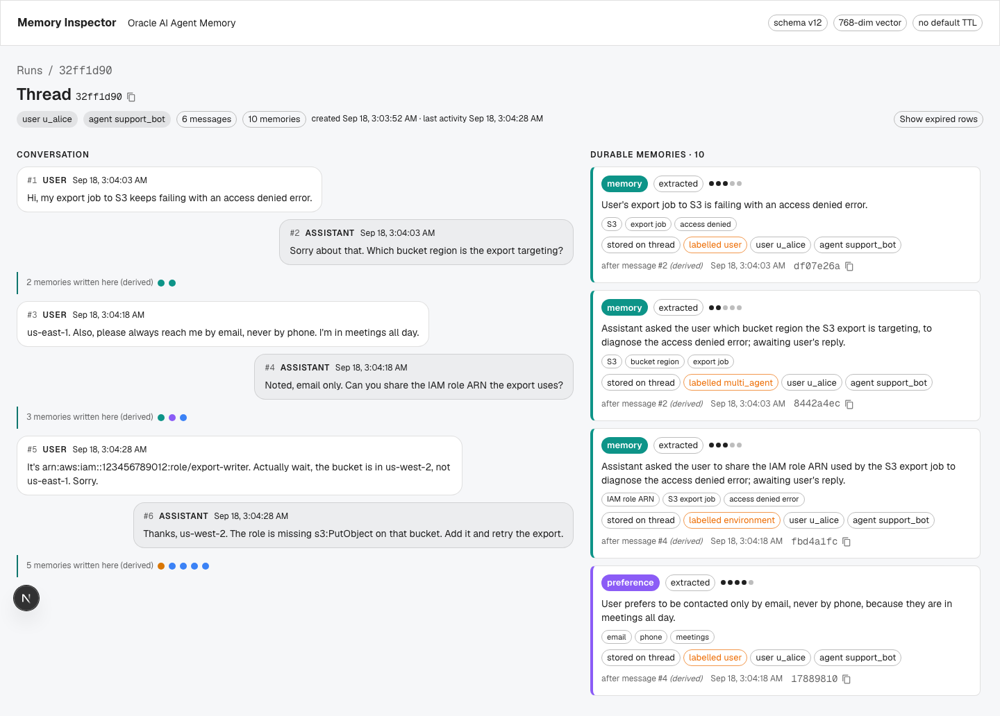

# oaam-playground: agent memory inspector

A memory debugger for [Oracle AI Agent Memory](https://pypi.org/project/oracleagentmemory/) (`oracleagentmemory` 26.6). An agent says something odd and you want to know why. This shows you what it remembered, which memories reached the prompt, and what's wrong with the store underneath.

It's a personal work sample, built to learn the package. It's not an Oracle product.



## What's in it

| directory | what it is |
|---|---|
| `inspector/` | **`memory-inspector`**, the library. Wrap your client with `inspect()` and every turn is recorded: searches with their cosine distances, memory created, updated and deleted, and a timed trace of the package's own work. `memory-inspector check` runs a health check on the whole store. |
| `web/` | **The dashboard** (Next.js, read-only). Step through a conversation turn by turn, ask "why did it say that?" of any reply, see each turn's lifecycle as a waterfall, and read health findings with evidence and a suggested fix. |
| `companion/` | **The companion**, a small real agent that uses the library. `/why` in the terminal explains its last reply. |
| `labs/` | **Three Jupyter labs** on one loop: look, find, fix, check again. |
| `agent/` | Seed data, setup scripts, and the spikes the design depends on. |
| `infra/` | Oracle AI Database 26ai Free in Docker, plus the demo views. |
| `site/` | **A docs site** over `docs/`, with a replay of the seeded demo that runs in the browser. No database needed: `cd site && npm install && npm start`. |
| `docs/` | Everything else. Start at [docs/README.md](docs/README.md). |

The health check finds stale memories that a correction never replaced, contradictions, duplicates, conversation state stored as if it were a durable fact, and the turns where those crowded real memories out of the prompt. It uses SQL vector distance to find candidates and an LLM judge to decide.

Building this turned up five things the package could do better. Each one has a reproduction script: [friction log and five fixes](docs/friction.md).

## Quick start

You need Docker, [uv](https://docs.astral.sh/uv/), Node 20+, an Anthropic API key, and local [Ollama](https://ollama.com) with `nomic-embed-text` for embeddings.

```bash
cp infra/.env.example infra/.env        # set four passwords
cp agent/.env.example agent/.env        # add your API key
docker compose -f infra/docker-compose.yml up -d

cd agent && uv sync
uv run python scripts/seed.py --reset   # replays 4 conversations, then a health check (~4 min)
uv run python scripts/apply_sql.py      # views, run log and grants for the dashboard

cd ../web && cp .env.example .env.local # AIM_WEB_PASSWORD from infra/.env
npm install && npm run dev              # http://localhost:3000
```

Then run `uv run python scripts/demo_links.py` from `agent/` to get links straight to the interesting turns. The [first-run tutorial](docs/tutorial/first-run.md) walks the same path with what you should see at each step.

To talk to the companion with your own data, which goes in a separate `aim_live` schema that never gets reset:

```bash
cd agent && uv run python scripts/apply_sql.py --user aim_live --create-store
cd ../companion && uv sync && uv run companion
```

## Documentation

| I want to… | read |
|---|---|
| see it work from a clean machine | [First run](docs/tutorial/first-run.md) |
| show it to someone | [Demo guide](docs/how-to/demo.md) |
| understand how it works | [How it works](docs/explanation/how-it-works.md) · [The health check](docs/explanation/health-checks.md) |
| add it to my own agent | [Instrument your own agent](docs/how-to/instrument-your-agent.md) |
| reseed, upgrade, fix something | [Operate and troubleshoot](docs/how-to/operate.md) |
| look something up | [Library and CLI](docs/reference/inspector.md) · [Data model](docs/reference/data-model.md) · [Dashboard](docs/reference/dashboard.md) · [Scripts and configuration](docs/reference/scripts-and-config.md) |

## Tests

```bash
cd inspector && uv run pytest -q
cd companion && uv run pytest -q
cd web && npm test
cd site && npm test
```

## License

Apache-2.0. See [LICENSE](LICENSE).
